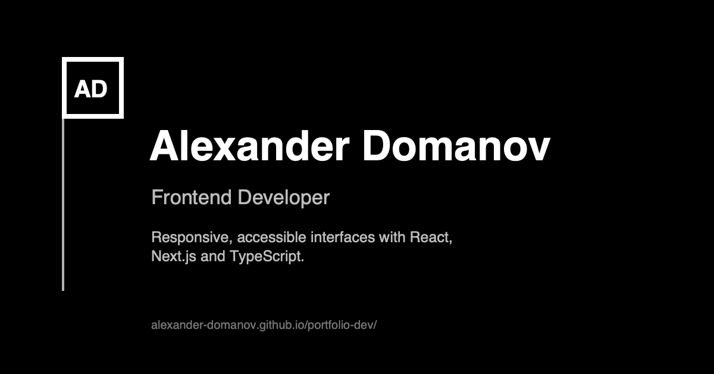

# Alexander Domanov — Frontend Developer

A personal portfolio showcasing selected frontend projects, development practices and the tools I use to build responsive, accessible interfaces.

[View the live portfolio](https://alexander-domanov.github.io/portfolio-dev/)



## Selected projects

- **Inctagram** — A team-built social platform with profiles, posts, subscriptions, notifications and a separate administration dashboard.
- **Place of Memory** — A team-built multilingual memorial platform with public pages, articles, an interactive map and an administration dashboard.

Repository links for both projects are available on the live portfolio.

## Portfolio website

The portfolio itself is built with:

- HTML
- SCSS
- Vanilla JavaScript ES modules
- Vite

The interface uses semantic HTML, responsive layouts, keyboard-accessible interactions, progressive enhancement and reduced-motion support.

## Project structure

```text
.
├── index.html
├── public/
├── src/
│   └── scripts/
├── scss/
├── vite.config.mjs
└── .github/
    └── workflows/
```

Generated `dist/` output and installed dependencies are not stored in the repository.

## Local development

Install dependencies and start the Vite development server:

```sh
npm ci
npm run dev
```

Create a production build or preview it locally:

```sh
npm run build
npm run preview
```

## Quality checks

```sh
npm run check:format
npm run check:styles
npm run check:html
npm run check:js
npm test
```

`npm test` is currently a placeholder command and reports that no tests have been added yet.

## Deployment

The site is deployed to GitHub Pages through GitHub Actions from the `main` branch. Vite is configured with the project-site base path `/portfolio-dev/`, and the workflow builds and publishes `dist/` as the Pages artifact.
